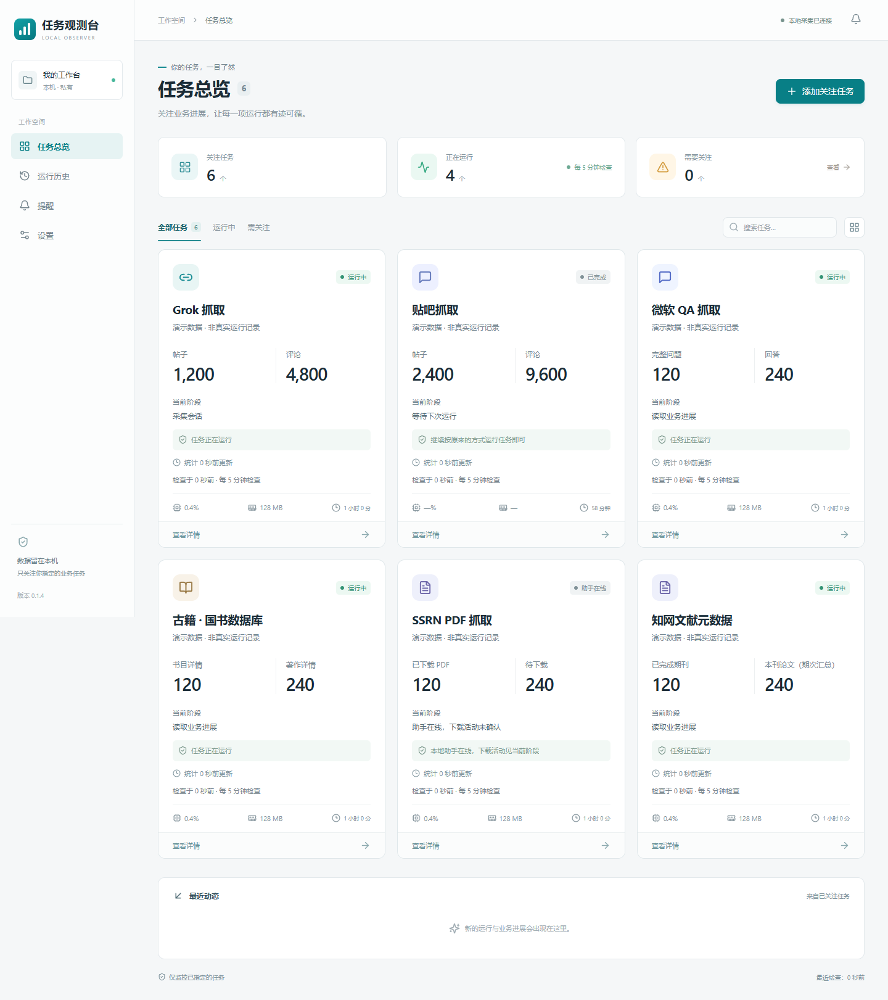
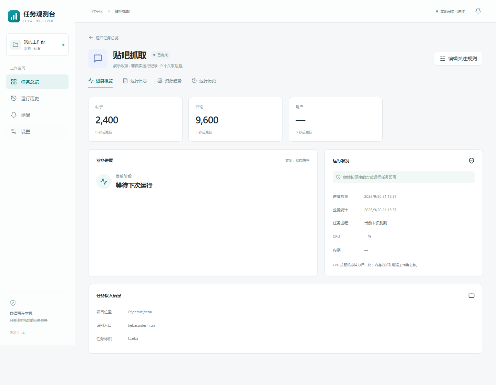

# 任务观测台

Windows 本地业务任务监控应用。只关注用户登记的脚本或模块，不展示系统后台程序。使用 Tauri 2、React、TypeScript、shadcn/ui 组合组件、Python / psutil 和 SQLite。



> 图中数字均为合成演示数据。新安装默认没有任务；软件不会创建演示任务。

## 使用

面向 Windows 10/11 x64。每项关注任务一张卡片，点击进入独立详情页，提供进度、日志、资源趋势和运行历史；返回总览保留筛选和滚动位置。

首次打开后点击“添加关注任务”，填写项目位置、脚本或模块入口与进度来源。已登记但没有运行的任务仍保留卡片。任务通过原来的方式启动，仪表盘只负责观察。

关闭窗口后继续在托盘监控；托盘菜单“退出（停止监控）”才结束本应用。开机自启默认关闭，可在设置中启用。无需账号、云服务或局域网服务。

公开版应用数据保存在 `%LOCALAPPDATA%\local.taskobserver.desktop`，包括 SQLite 和 WebView 缓存；可在启动前通过 `TASK_OBSERVER_DATA_DIR` 环境变量指定其他目录。也可在已安装的应用 EXE 旁放置 `observer-local.json`，内容为 `{"data_dir":"C:/your/observer-data"}`；环境变量优先。本机配置不进入源码仓库。设置页会显示实际位置。升级旧的定制版本时，如需沿用原历史，应先退出旧版并配置原数据目录；不要同时打开两个采集器写同一个数据库。



### 添加任务

- 使用明确的脚本路径，或模块名称加项目工作目录；需要时限定运行子命令。
- 不知道业务进度格式时可选择“仅监控进程”。它不推测成功、失败、完成比例或卡死。
- 支持通用 JSON 状态文件。先保存关注任务，从详情页获得 `task_id`，再由自己的任务程序生成状态文件。
- 所有任务数据来源只读。本应用不修改业务代码，不执行运行、停止、重试、调度或数据库修复命令。

## 通用进度接口（版本 1）

```json
{
  "schema_version": 1,
  "task_id": "从任务详情页获取",
  "run_id": "每次运行唯一，例如 train-20260920-01",
  "status": "running",
  "stage": "模型训练",
  "updated_at": "2026-09-20T12:00:00+08:00",
  "statistics_at": "2026-09-20T12:00:00+08:00",
  "started_at": "2026-09-20T11:00:00+08:00",
  "completed": 12,
  "total": 40,
  "metrics": [
    {"key": "epoch", "label": "Epoch", "value": 12, "unit": ""},
    {"key": "loss", "label": "Loss", "value": 0.284, "unit": ""}
  ]
}
```

这段是格式示例，不是实际训练结果。状态文件必须是 UTF-8 JSON 对象，最大 4 MB；推荐任务程序写入临时文件后原子替换。`task_id`、`run_id`、`updated_at` 必须有效；数字缺失使用 `null`。`completed` 和 `total` 均有效且总量大于零才显示比例。不知道总量时省略二者。

可用状态包括 `running`、`completed`、`failed`、`needs_attention`、`completed_with_gaps`。失败原因使用 `error`，待处理说明使用 `message`。可选的 `heartbeat_at` 表示任务心跳；进程运行但心跳超过 15 分钟时提示关注。业务指标数组最多显示 20 项；GPU 可作为任务实际提供的指标，不把整机 GPU 利用率推断成单任务值。

## 现有适配器

- 贴吧：读取 `work/runtime/status.json`，帖子、评论和用户数量使用 `research_files.row_count`，不将内部实体条数混充正式导出数量。活动监控不打开贴吧 SQLite。
- Grok：在采集器内按项目隔离加载原有只读进度模块，保留项目自身的配置和活动数据库定位逻辑；不启动外部 Python 或 PowerShell，不带 `--save`，不写 `__pycache__`。数据库单项查询限 0.35 秒，共享 3 秒预算，每 5 分钟检查一次；原统计时间与部分缓存标记保留。超时项保持未知或沿用明确标记的旧值，不把读取异常当成业务失败。
- Microsoft Q&A：读取既有 `progress.json` 的问题、回答、评论、用户及阶段，每 5 分钟检查一次，不扫描业务数据库。来源程序通常约每 60 秒发布快照。
- 国书数据库：读取原始数据目录中的书目、著作、作者清单，按已完成分片区间和当前 JSONL 完整行统计累计详情记录。每 5 分钟检查一次，不解压或扫描全部正文。记录可能包含源站返回的不存在项，覆盖全部索引不自动判定运行成功。
- SSRN PDF：仅读取现有本地 helper 的 `/pdf/summary` 和在途 `/pdf/queue` GET 接口，默认端口 18765，每 5 分钟检查一次。卡片区分“助手在线”和队列近期活动，不把后台进程存在当作浏览器正在下载；资源和历史只统计助手。
- 知网元数据：使用 SQLite `mode=ro`、`query_only` 和 2 秒查询期限，每 5 分钟读取期刊及当前期刊的期次汇总。卡片显示已完成期刊与本刊论文（期次汇总），不查询全库文章数，也不声称跨期去重；切换期刊后本刊数量会重置。超时保留旧值并提示采集异常。
- 自动周期统一为 300 秒，按每轮开始计时；首次启动和保存关注规则立即检查，同一适配器不重叠，休眠恢复不补跑积压周期。采集完成通过本地事件立即更新界面，不再等待下个周期。卡片同时展示统计时间和检查时间；检查发生并不保证源数据有变化。
- 系统资源：每 5 分钟采样一次。PID 与创建时间联合识别进程，子进程归并。CPU 为两次采样之间的平均值，按整机逻辑 CPU 数归一化；内存为关联进程工作集之和，可能包含共享页。
- 日志：打开日志页后每 5 分钟按需读取最近 200 行，单次最多 128 KB；支持日志文件或目录中的最新 `.log`。常见凭据字段会遮盖，但不承诺识别任意自定义敏感内容。

## 数据和状态边界

进程状态与业务健康分开显示。运行中允许存在待核查事项。CPU 低、日志短时不变、抓取冷却不直接判定卡死。进程消失但没有明确结果，显示“结果未确认”。旧快照不会被当作新启动任务的当前进度。

历史从本应用实际观察开始。退出应用、关机或休眠造成的观察缺口，不补写虚构的结束时间或成功结果。趋势每 5 分钟保存一条，页面展示最近 24 小时，运行和提醒记录保留在本机。第一版不自动删除历史记录。

Windows 桌面通知遵守系统的通知设置及勿扰模式；应用内提醒始终可查看。相同任务、相同异常代码在连续存在期间只通知一次。标记已读不意味着问题已解决；恢复后再次发生会创建新提醒。

## 开发与构建

源码目录：`src/` 为界面，`src-tauri/` 为桌面宿主，`collector/` 为 Python 采集器，`tests/` 为独立测试，`scripts/` 为构建工具。

依赖版本由 `package-lock.json`、`src-tauri/Cargo.lock` 和 `collector/requirements-build.txt` 锁定。需要 Node.js 22.12+、Python 3.11、PowerShell 7；桌面编译另外需要 Rust MSVC 工具链、Microsoft C++ Build Tools（C++ 桌面开发和 Windows SDK）及 WebView2。

```powershell
git clone https://github.com/Wang335533/task-observer.git
cd task-observer
python -m venv .venv
.\.venv\Scripts\python.exe -m pip install -r collector/requirements-build.txt
npm ci
npm run dev
```

开发预览仅在 `127.0.0.1:1420` 开放开发服务器，通过服务器侧标准输入输出连接独立采集器。开发数据库默认在仓库相邻的 `work/preview-data`；也可用 `TASK_OBSERVER_DATA_DIR` 指定。生产桌面应用使用 Tauri IPC 和采集器 stdio，不开放 HTTP 端口。

构建 Windows 安装包：

```powershell
.\scripts\build.ps1
```

脚本使用已安装的 Rust；如仓库相邻存在 `toolchains/cargo` 则优先使用该本地工具链。它不安装系统编译工具。采集器通过 PyInstaller 打包后作为 sidecar 分发，用户无需额外安装 Python。NSIS 安装包位于 `src-tauri/target/release/bundle/nsis/`，另复制至仓库相邻的 `outputs/`。

本地验证：

```powershell
.\.venv\Scripts\python.exe -m pytest tests/test_collector.py tests/test_sources.py -q
npm run build
npm run test:ui
# 构建采集器后检查打包版本的 stdio 协议
.\.venv\Scripts\python.exe scripts/smoke_collector.py
```

UI 测试使用 Microsoft Edge，自动启动开发服务器并拦截 RPC，完全使用合成数据，不读取用户任务。Python 测试使用临时目录和模拟进程。CI 在 Windows 上运行 Python 测试、前端构建和 UI 测试；桌面安装包需另行执行完整构建。

## 架构

React 界面通过 `collector_request(method, params)` 请求 Tauri；Rust 将限定方法转为带请求编号的 JSON 行发送至 Python 采集器。响应与请求对应，异常通知为独立消息。采集器后台线程采样资源；业务适配器线程池独立执行，单任务不重叠。SQLite 只保存仪表盘自己的信息。

接口方法：`snapshot`、`detail`、`logs`、`history`、`save_task`、`set_notifications`、`acknowledge`。没有通用命令执行或业务进程控制接口。

Grok 的现有模块和业务解释器仍由原项目提供，仪表盘不会将它的整个环境打包或复制。模块或字段发生变化时，需要调整对应适配器。

学习参考：Glances 的采集扩展、Beszel 的采集与展示分离、Prefect 的运行记录组织。未嵌入这些项目的运行服务。shadcn/ui 组合组件遵循 Radix Slot / Dialog 与 class-variance-authority 模式。

## 适配范围与限制

这些业务适配器面向特定项目的进度结构，相关抓取项目、凭据和数据不包含在此仓库。`grokspider.progress` 必须由使用者自己的项目提供并确保只读；同名第三方模块不保证兼容。其他项目优先使用通用 JSON 或仅监控进程模式。

目前仅提供 Windows x64 构建。未提供业务启动、停止、重跑或调度功能。系统托盘和通知需要桌面环境，浏览器预览不支持这些系统功能。Windows 实际横幅显示受系统通知设置影响；应用退出期间不会补录完整历史。

## 许可证与致谢

本项目采用 [MIT 许可证](LICENSE)。第三方组件遵循各自许可证，见 [THIRD_PARTY_NOTICES.md](THIRD_PARTY_NOTICES.md)。架构学习参考 [Glances](https://github.com/nicolargo/glances)、[Beszel](https://github.com/henrygd/beszel) 和 [Prefect](https://github.com/PrefectHQ/prefect)；未嵌入它们的服务或复制业务代码。

自动刷新统一为 5 分钟：总览、进程资源、全部业务适配器、趋势记录、详情和日志。隐藏界面停止定时查询，恢复可见时读取后台缓存；后台监控和桌面通知继续。进度快照与心跳超过 15 分钟才提示过期，明确读取错误仍在本轮显示。短于采样间隔的运行可能被遗漏，异常发现可能延迟约一个周期加读取耗时；不会推测遗漏运行的结果。抓取程序自身的发布周期不受修改。

关闭窗口后使用 WebView2 TrySuspend 休眠界面，打开时 Resume，保留筛选、页签与滚动位置；后台采集和通知继续。休眠是尽力降低内存，不保证全部释放。最近成功的进度快照保存在本应用数据库中；重启后可恢复带原统计时间的缓存，关注规则变化时不复用旧缓存。

采集器每 5 分钟进行一次轻量健康检查，退出或采样超过 15 分钟未完成时尝试恢复。只关闭本应用持有的采集器标准输入，最多等待 50 秒；未退出则不创建第二个实例。连续恢复最多 3 次，检查间隔退避为 5 / 10 分钟；最后一次启动再给一个检查周期验证，失败后暂停自动恢复、显示错误，并在已启用通知时发送桌面提醒。不会启动、停止或重跑业务抓取。`ui-power.json` 与 `collector-health.json` 各保留一条本地诊断状态。
